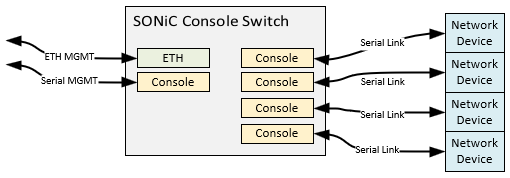
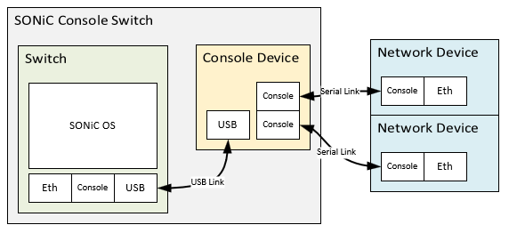
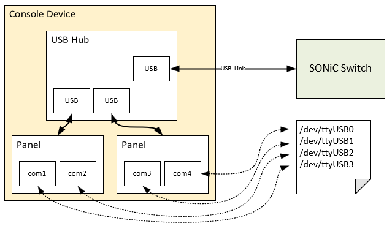
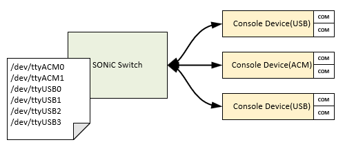
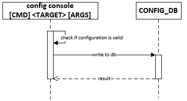
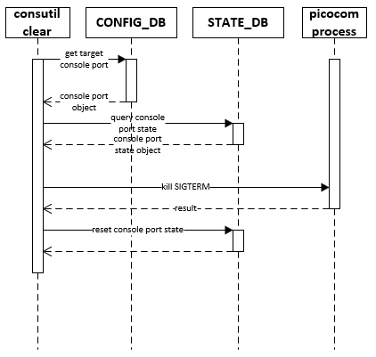
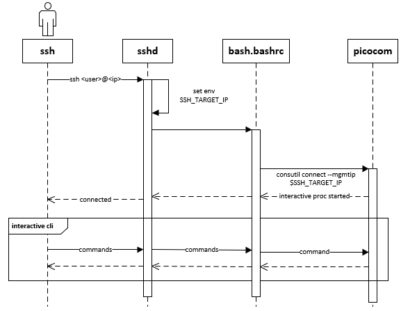

# SONiC Console Switch

# High Level Design Document

#### Revision 0.2

# Table of Contents

- [SONiC Console Switch](#sonic-console-switch)
- [High Level Design Document](#high-level-design-document)
      - [Revision 0.2](#revision-02)
- [Table of Contents](#table-of-contents)
- [List of Tables](#list-of-tables)
- [Revision](#revision)
- [About this Manual](#about-this-manual)
- [Scope](#scope)
- [Definition/Abbreviation](#definition-abbreviation)
    + [Table 1: Abbreviations](#table-1--abbreviations)
- [1 Feature Overview](#1-feature-overview)
  * [1.1 Requirements](#11-requirements)
    + [1.1.1 Functional Requirements](#111-functional-requirements)
    + [1.1.2 Configuration and Management Requirements](#112-configuration-and-management-requirements)
  * [1.2 Design Overview](#12-design-overview)
    + [1.2.1 Basic Approach](#121-basic-approach)
    + [1.2.2 Container](#122-container)
- [2 Functionality](#2-functionality)
  * [2.1 Target Deployment Use Cases](#21-target-deployment-use-cases)
  * [2.2 Functional Description](#22-functional-description)
  * [2.3 Limitations](#23-limitations)
- [3 Design](#3-design)
  * [3.1 Overview](#31-overview)
    + [3.1.1 Persist console port configurations](#311-persist-console-port-configurations)
    + [3.1.2 Connect to a remote device](#312-connect-to-a-remote-device)
    + [3.1.3 Reverse SSH](#313-reverse-ssh)
    + [3.1.4 Underlying TTY Device Management](#314-underlying-tty-device-management)
    + [Table 2: Underlying device mapping definition sample](#table-2--underlying-device-mapping-definition-sample)
  * [3.2 DB Changes](#32-db-changes)
    + [3.2.1 CONFIG_DB](#321-config-db)
      - [CONSOLE_PORT_TABLE](#console-port-table)
    + [3.2.2 APP_DB](#322-app-db)
    + [3.2.3 STATE_DB](#323-state-db)
      - [CONSOLE_PORT_TABLE](#console-port-table-1)
    + [3.2.4 ASIC_DB](#324-asic-db)
    + [3.2.5 COUNTER_DB](#325-counter-db)
  * [3.3 CLI](#33-cli)
    + [3.3.1 General Command](#331-general-command)
      - [3.3.1.1 Show line](#3311-show-line)
      - [3.3.1.2 Config](#3312-config)
        * [3.3.1.2.1 Add/Del Console Port](#33121-add-del-console-port)
        * [3.3.1.2.2 Update Remote device name for a Console Port](#33122-update-remote-device-name-for-a-console-port)
        * [3.3.1.2.3 Update Baud for a Console Port](#33123-update-baud-for-a-console-port)
        * [3.3.1.2.4 Enable Flow control for a Console Port](#33124-enable-flow-control-for-a-console-port)
        * [3.3.1.2.5 Add/Del management IP for a Console Port](#33125-add-del-management-ip-for-a-console-port)
    + [3.3.2 Consutil Command](#332-consutil-command)
      - [3.3.2.1 Show line](#3321-show-line)
      - [3.3.2.2 Clear line](#3322-clear-line)
      - [3.3.2.3 Connect line](#3323-connect-line)
  * [3.4 Reverse SSH](#34-reverse-ssh)
    + [3.4.1 Basic Usage](#341-basic-usage)
    + [3.4.2 Port based Forwarding](#342-port-based-forwarding)
    + [3.4.3 IP based Forwarding](#343-ip-based-forwarding)
  * [3.5 Example Configuration](#35-example-configuration)
    + [3.5.1 CONFIG_DB object for console port](#351-config-db-object-for-console-port)
- [4 Flow Diagrams](#4-flow-diagrams)
  * [4.1 Create/Update of Console Port Objects](#41-create-update-of-console-port-objects)
  * [4.2 Show lines](#42-show-lines)
  * [4.3 Clear line](#43-clear-line)
  * [4.4 Connect line in SONiC](#44-connect-line-in-sonic)
  * [4.5 Connect line via SSH](#45-connect-line-via-ssh)
    + [4.5.1 Basic Usage](#451-basic-usage)
    + [4.5.2 Port based Forwarding](#452-port-based-forwarding)
    + [4.5.3 IP based Forwarding](#453-ip-based-forwarding)
- [5 Error Handling](#5-error-handling)
- [6 Serviceability and Debug](#6-serviceability-and-debug)
- [7 Warm Boot Support](#7-warm-boot-support)
- [8 Scalability](#8-scalability)
- [9 Reference](#9-reference)

# List of Tables

[Table 1: Abbreviations](#table-1-abbreviations)

[Table 2: Underlying device mapping](#table-2-underlying-device-mapping-definition-sample)

# Revision

| Rev |     Date    |          Authors             | Change Description                |
|:---:|:-----------:|:----------------------------:|-----------------------------------|
| 0.1 | 08/28/2020  |  Jing Kan | Initial version                   |
| 0.2 | 09/10/2020  |  Jing Kan | Addressed first version's comments                   |

# About this Manual

This document provides general information about Console switch features implementation in SONiC

# Scope

This document describes the functionality and high level design of the Console switch features in SONiC.

# Definition/Abbreviation

### Table 1: Abbreviations

| Term | Meaning
|---|---|
| SSH | **S**ecure **S**hell |
| CLI | **C**ommand **L**ine **I**nterface |
| OS | **O**perating **S**ystem |
| USB | **U**niversal **S**erial **B**us |
| TTY | **T**ele**TY**pewriter, terminal for text input/output environment |
| PID | **P**rocess **ID**entification number |
| ETH | **ETH**ernet |
| UTC | **C**oordinated **U**niversal **T**ime |
| MGMT | **M**ana**G**e**M**en**T** |
| TCP | **T**ransmission **C**ontrol **P**rotocol |

# 1 Feature Overview

Console Switch enable user to manage routers/switches via console port.

## 1.1 Requirements

### 1.1.1 Functional Requirements

1. Support configuration of flow control on each console port
1. Support configuration of baudrate on each console port
1. Support access console line via reverse SSH

### 1.1.2 Configuration and Management Requirements

1. Support configuration using SONiC CONFIG_DB
1. Support configuration using SONiC MINIGRAPH
1. Support configuration using SONiC config CLI
1. Support record the console line state in STATE_DB

## 1.2 Design Overview

### 1.2.1 Basic Approach

Enable SONiC device to manage connected Console device(Serial Hub).

Persist console configurations to control how to view/connect to a device via serial link, includes:

- Line Number
- Flow Control switch
- Remote Device Name
- Management IP (optional)

SONiC OS provider a set of config cli utility to help user config above configurations anytime.

SONiC OS provide a unified cli utility to help user connect and manage remote device.
User use SSH to connect to SONiC device via SONiC management IP.

### 1.2.2 Container

No new containers are introduced.

# 2 Functionality

Refer to section 1

## 2.1 Target Deployment Use Cases

Configure/Manage remote devices via console port in SONiC.

## 2.2 Functional Description

Refer to section 1.1

## 2.3 Limitations

- Configuration is only supported on console port.
- Only one active session can alive on a console line.

# 3 Design

## 3.1 Overview

The design overview at a high level:


SONiC OS is run on a regular network router or switch.

The Console device is serial hub which enable user to manage multiple network devices via console.

Console device(s) are connect to the SONiC device as add-on. In current design, there are no limitation to the way you can connect and no limit to the number of add-on devices. All limitation is on SONiC switch's hardware interfaces and console device's driver.

The SONiC switch and add-on console devices are as a whole in our design, the hardware topology should be defined at the very beginning stage. In user's aspect, the SONiC console switch is looks like below:



User will see there is a single SONiC box which can provide management functions and console device accessing ability.

Below diagram shows an example that a console device connect to a SONiC device by using USB link:



SONiC console switch designer can use daisy-chain to add new console device to extend more console ports.

User can access Network Devices through SONiC Switch.

### 3.1.1 Persist console port configurations

Console port settings are persist in CONFIG_DB.

The configuration can be load from both `config_db.json` and `minigraph.xml` and editing by using `config` cli.

### 3.1.2 Connect to a remote device

A command line utility which enable user to connect to remote network device and manage them via console.

### 3.1.3 Reverse SSH

The SONiC ssh enable user to connect to a console line without opening more TCP ports natively.

```bash
ssh <user>@<host> consutil connect <line>
```

For better user experience, a customized sshd which can leave forwarding information in user's session will be install to SONiC OS. The default `/etc/bash.bashrc` will be modified and it will pick the forwarding setting and enter the interactive cli automatically.

Two kinds of reverse SSH connection style will be support:

A: Port based Forwarding

```bash
ssh <user>:<line>@<host>
```

B: IP based Forwarding

```bash
ssh <user>@<ip>
```

For A, user need to specific the line number by following a colon after username. Below example shows that how to connect to console line 1 via SONiC host.

```bash
# example
ssh tom:1@host
```

By default, the content between `:` and `@` will be trimmed by sshd before it do authentication and the trimmed string will be dropped silently. To use this segment as line number for reverse SSH feature, we need to modify the source ode of OpenSSH and put this segment to a environment variable `$SSH_TARGET_CONSOLE_LINE`, then we can insert a short script into `/etc/bash.bashrc` and run command `consutil connect $SSH_TARGET_CONSOLE_LINE` to enter the management session automatically after user login.

For B, there are multiple management IPs binding to the SONiC device and mapping to each console port, for example:

```
   IP       ->  Console Line Number -> Remote Device
2001:db8::1 ->          1           ->   DeviceA
2001:db8::2 ->          2           ->   DeviceB
2001:db8::3 ->          3           ->   DeviceC
```

Then we can use below commands to connect to a remote device, what's more, we can use DNS to help us access the remote device more directly.

```bash
# example
# connect to deviceA
ssh tom@2001:db8::1

# connect to DeviceB
ssh tom@2001:db8::2

# Assume that domain name DeviceC.co point to 2001:db8::3
ssh tom@DeviceC.co
```

The mechanism behind it is actually very similar to mode A. We will record the target ssh host IP address to a environment variable `$SSH_TARGET_IP`. Since we have stored the relationship between line number and it's management IP, then we can easily start the management session automatically after user login by calling `consutil connect` command in `/etc/bash.bashrc`. If the management IP were not found in config db (consutil connect failed due to target not found), then we will fall back to normal SONiC management bash session.

### 3.1.4 Underlying TTY Device Management

By default, the add-on console device will present as a set of tty devices under `/dev` directory. The typical naming format is:

> tty&lt;Driver Name&gt;&lt;Sequence Number&gt;

For example: `ttyUSB0`

Usually, tty devices will mapping to each console device port, but the sequence might not aligned with hardware designed port number which means when you notice that there is a ttyUSB0, it probably not binding to panel's port 0.

Below is an example, we can look into the inner topology of a console device:



The console device have 4 com ports at front panel with product port numbers from 1 to 4. After we connected the console device to SONiC switch, the SONiC OS will detect 4 tty device and put them under `/dev` directory.

From SONiC aspect, we are hard to aware how the tty device mapped to physical console port because its depends on the external hardware design and OS kernel behavior. Then we need to create alias for all tty devices by using some rule. Here[[1]](https://github.com/Azure/SONiC/blob/master/doc/udev-terminalserver/udev%20rules%20for%20Terminal%20Server.md) is an design for resolving USB terminal server's port mapping problem by leveraging udev rule, it use the usb hardware metadata which are immutable to determine the relationship between underlying tty devices and front panel ports.

Regardless of the console device type, the rule is required. We define below function `g()` for determining the alias name for a console port:

```
tty_device_alias_name <- g(console_port_name)
```

The rule will map each hardware port to an alias tty device which name were generated by above function `g()`. Once the rule been applied, the underlying hardware detail and origin tty devices will be transparent for all upper layer applications.

In other hand, no matter how many add-on devices and how you connect to the console device. We treat them as a single box with SONiC switch which means you need to create aliasing rules for all your add-on devices. Once the mapping finalized, we can create alias name for all tty devices, we can use `g()` to find the alias tty device under `\dev` directory.

Below is an example. Assume that we have three add-on console devices which are using different driver. Each device have 2 com ports at frontend.



The console switch designer should create a description document which can explain how the physical console port mapped to SONiC console port.

For example, we can create below mapping table, it defined the sequence of console port in SONiC switch's angle. Obviously, the order and port mapping should be determined by the SONiC console switch designer.

#### Table 2: Underlying device mapping definition sample

| tty device name | product port | console port name  | tty device alias |
|---|---|---|---|---|
| ttyUSB0 | 1 | 0 | ttySONiC0 |
| ttyUSB1 | 2 | 1 | ttySONiC1 |
| ttyACM0 | 1 | 2  | ttySONiC2 |
| ttyACM1 | 2 | 3  | ttySONiC3 |
| ttyUSB2 | 1 | 4  | ttySONiC4 |
| ttyUSB3 | 2 | 5  | ttySONiC5 |

*The device alias' naming is just a sample*

Once the mapping built, we can use it to locate tty device alias without caring about the underlying hardware detail. SONiC console cli don't need to aware all the hardware layer complexity and design detail.

## 3.2 DB Changes

This section describes the changes made to different DBs for supporting Console switch features.

### 3.2.1 CONFIG_DB

The CONSOLE_PORT_TABLE holds the configuration database for the purpose of console port connection parameters. This table is filled by the management framework.

#### CONSOLE_PORT_TABLE

```
; Console port table
key = CONSOLE_PORT:port

; field = value
remote_device = 1*255 VCHAR             ; name of remote device
baud_rate     = 1*11 DIGIT              ; baud rate
flow_control  = "0"/"1"                 ; "0" means disable flow control
                                        ; "1" means enable flow control
mgmt_ip       = ipv4_prefix/ipv6_prefix ; optional field,
                                        ; use for ip forwarding
```

### 3.2.2 APP_DB

No changes are introduced in APP_DB.

### 3.2.3 STATE_DB

The CONSOLE_PORT_TABLE holds the state database for the purpose of console port connection state. This table is filled by the console cli.

#### CONSOLE_PORT_TABLE

```
; Console port table
key = CONSOLE_PORT|port

; field = value
state      = "idle"/"busy"              ; "idle" means the line is idle
                                        ; "busy" means the line is busy
pid        = 1*11 DIGIT                 ; process id of current line session
                                        ; 0 if the line is idle
start_time = 1*11 DIGIT                 ; unix timestamp (UTC),
                                        ; the process start time
                                        ; 0 if the line is idle
```

### 3.2.4 ASIC_DB

No changes are introduced in ASIC_DB.

### 3.2.5 COUNTER_DB

No changes are introduced in COUNTER DB.

## 3.3 CLI

### 3.3.1 General Command

#### 3.3.1.1 Show line

Alias of `consutil show`

```
show line
```

Refer to [3.3.2.1 Show line](#3321-show-line)

#### 3.3.1.2 Config

##### 3.3.1.2.1 Add/Del Console Port

This command use for create/delete a console port configuration object.

```bash
config console {add|del} <port_name> [--baud <baud>] [--flowcontrol] [--devicename <remote_device>] [--mgmtip <line mgmt ip>]
```

If specified `--flowcontrol` then the flow control switch for this port will be set to enable.

Sample Usage:

```bash
# Add console port 1 with baud 9600
config console add 1 --baud 9600

# Add console port 2 with baud 9600 and enable flowcontrol
config console add 2 --baud 9600 --flowcontrol

# Remove console port 1
config console del 1
```

##### 3.3.1.2.2 Update Remote device name for a Console Port

```bash
config console remote_device <port_name> <value>
```

Sample Usage:

```bash
# Update remote device description for console port 1
config console remote_device 1 switch1
```

##### 3.3.1.2.3 Update Baud for a Console Port

```bash
config console baud <port_name> <value>
```

Sample Usage:

```bash
# Update baudrate for console port 1
config console baud 1 115200
```

##### 3.3.1.2.4 Enable Flow control for a Console Port

```bash
config console flow_control {enable|disable} <port_name>
```

Sample Usage:

```bash
# Enable flow control on console port 1
config console flow_control enable 1
```

##### 3.3.1.2.5 Add/Del management IP for a Console Port

```bash
config console mgmt_ip {add|del} <port_name> [<value>]
```

The management IP will be added to current SONiC host management IP list too.
The management IP must be empty before adding it.

Sample Usage:
```bash
# Remove the line management IP binding on console port 1
config console mgmt_ip del 1

# Add the line management IP binding on console port 1
config console mgmt_ip add 1 2001:db8::1
```

### 3.3.2 Consutil Command

consutil command provider a unified way to access/manage the remote network device.

```
Usage: consutil [OPTIONS] COMMAND [ARGS]...

  consutil - Command-line utility for interacting with switches via console
  device

Options:
  --help  Show this message and exit.

Commands:
  clear    Clear preexisting connection to line
  connect  Connect to switch via console device - TARGET...
  show     Show all lines and their info
```

#### 3.3.2.1 Show line

Show all registered lines and their information.

```bash
consutil show
```

Following information will be display:

- Line
- Actual/Configured Baud
- PID
- Start Time of process
- Remote device name
- Management IP

A `*` mark will display in front of line number if it is busy now.

#### 3.3.2.2 Clear line

Clear preexisting connection to line.

```
consutil clear [OPTIONS] <TARGET>
```

The TARGET can be remote device name or line management IP if specific option `--devicename` or `--mgmtip`

It will sending SIGTERM to process if the line is busy now, otherwise the command will exit directly.

Sample Usage:

```bash
# clear connection on line 1
consutil clear 1

# clear connection to remote deviceA
consutil clear --devicename deviceA

# clear connection to remote deviceA via its line management IP
consutil clear --mgmtip 2001:db8::1
```

#### 3.3.2.3 Connect line

Connect to switch via console.

```bash
consutil connect [OPTIONS] <TARGET>
```

The TARGET can be remote device name or line management IP if specific option `--devicename` or `--mgmtip`.

This command will connect to remote device by using picocom, it will create a interactive cli and join it if target line is not busy.

Sample Usage:

```bash
# connect to line 1
consutil connect 1

# connect to remote deviceA
consutil connect --devicename deviceA

# connect to remote device via line management IP
consutil connect --mgmtip 2001:db8::1
```

## 3.4 Reverse SSH

Reverse SSH enable user to connect different remote devices via same TCP port.

### 3.4.1 Basic Usage

```bash
ssh <user>@<host> consutil connect <line>
```

### 3.4.2 Port based Forwarding

```bash
ssh <user>:<line>@<host>
```

### 3.4.3 IP based Forwarding

```bash
ssh <user>@<IP Address(IPv4/IPv6)>
```

## 3.5 Example Configuration

### 3.5.1 CONFIG_DB object for console port

Console port 1 connect to a remote device `switch1` with baud_rate 9600 and enable flow control. Assigned a management IP address to this console line.

```json
{
    "CONSOLE_PORT": {
        "1": {
            "remote_device": "switch1",
            "baud_rate": "9600",
            "flow_control": "1",
            "mgmt_ip": "2001:db8::1"
        }
    }
}
```

User can manage remote device `switch1` by using below commands:

```bash
ssh <user>@<host> consutil connect 1
ssh <user>@<host> consutil connect --devicename switch1
ssh <user>@<host> consutil connect --mgmtip 2001:db8::1
ssh <user>:1@<host>
ssh <user>@2001:db8::1
```

Console port 2 connect to a remote device `switch2` with baud_rate 9600 and disable flow control.

```json
{
    "CONSOLE_PORT": {
        "2": {
            "remote_device": "switch2",
            "baud_rate": "9600",
            "flow_control": "0"
        }
    }
}
```

User can manage remote device `switch2` by using below commands:

```bash
ssh <user>@<host> consutil connect 2
ssh <user>@<host> consutil connect --devicename switch2
ssh <user>:2@<host>
```

# 4 Flow Diagrams

## 4.1 Create/Update of Console Port Objects

There are two ways can create/update the console port objects in CONFIG_DB:

The first way is to use configuration file.

Parse `minigraph.xml` or `config_db.json` and call sonic-cfggen to generate the console port objects, then store it to CONFIG_DB.


The second way is to use `config` cli.



## 4.2 Show lines


## 4.3 Clear line



## 4.4 Connect line in SONiC


## 4.5 Connect line via SSH

### 4.5.1 Basic Usage

Refer to section 3.4.1


### 4.5.2 Port based Forwarding

Refer to section 3.4.2


### 4.5.3 IP based Forwarding

Refer to section 3.4.3



# 5 Error Handling

- Invalid config errors will be displayed via console and configuration will be rejected

# 6 Serviceability and Debug

Debug output will be captured as part of tech support.

# 7 Warm Boot Support

The Console switch settings are retained across warmboot.

# 8 Scalability

The Console switch settings are applied to console ports.

The maximum number of console port setting is specific to the console hardware SKU.

If use USB, then the maximum number of add-on console device is specific to the maximum USB daisy-chain capability.

# 9 Reference

1. udev rules design for terminal server. Sandy Li. https://github.com/Azure/SONiC/blob/master/doc/udev-terminalserver/udev%20rules%20for%20Terminal%20Server.md