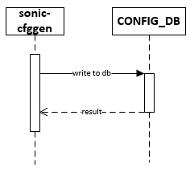
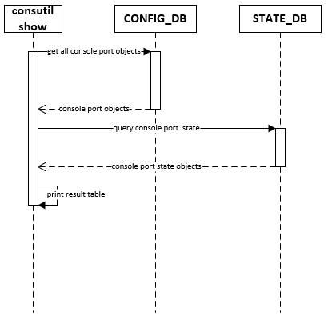
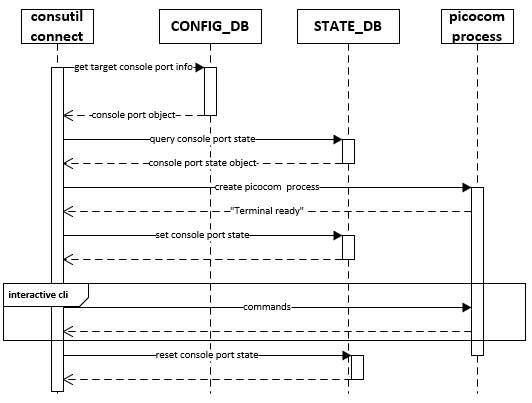
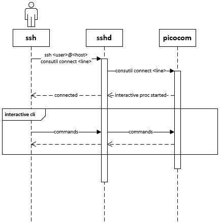
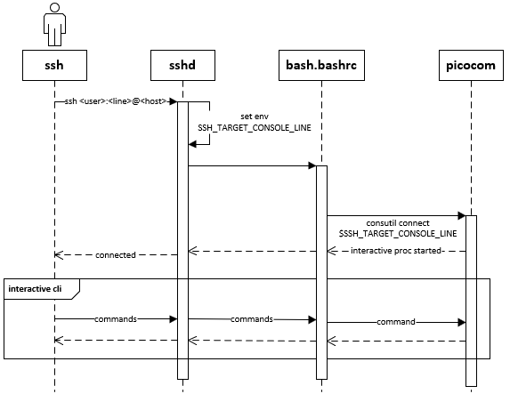

# SONiC Console Switch

# High Level Design Document

#### Revision 0.1

# Table of Contents
- [SONiC Console Switch](#sonic-console-switch)
- [High Level Design Document](#high-level-design-document)
      - [Revision 0.1](#revision-01)
- [Table of Contents](#table-of-contents)
- [List of Tables](#list-of-tables)
- [Revision](#revision)
- [About this Manual](#about-this-manual)
- [Scope](#scope)
- [Definition/Abbreviation](#definition-abbreviation)
    + [Table 1: Abbreviations](#table-1--abbreviations)
- [1 Feature Overview](#1-feature-overview)
  * [1.1 Requirements](#11-requirements)
    + [1.1.1 Functional Requirements](#111-functional-requirements)
    + [1.1.2 Configuration and Management Requirements](#112-configuration-and-management-requirements)
  * [1.2 Design Overview](#12-design-overview)
    + [1.2.1 Basic Approach](#121-basic-approach)
    + [1.2.2 Container](#122-container)
- [2 Functionality](#2-functionality)
  * [2.1 Target Deployment Use Cases](#21-target-deployment-use-cases)
  * [2.2 Functional Description](#22-functional-description)
  * [2.3 Limitations](#23-limitations)
- [3 Design](#3-design)
  * [3.1 Overview](#31-overview)
    + [3.1.1 Persist console port configurations](#311-persist-console-port-configurations)
    + [3.1.2 Connect to a remote device](#312-connect-to-a-remote-device)
    + [3.1.3 Reverse SSH](#313-reverse-ssh)
  * [3.2 DB Changes](#32-db-changes)
    + [3.2.1 CONFIG_DB](#321-config-db)
      - [CONSOLE_PORT_TABLE](#console-port-table)
    + [3.2.2 APP_DB](#322-app-db)
    + [3.2.3 STATE_DB](#323-state-db)
    + [3.2.4 ASIC_DB](#324-asic-db)
    + [3.2.5 COUNTER_DB](#325-counter-db)
  * [3.3 CLI](#33-cli)
  * [3.3.1 Consutil Command](#331-consutil-command)
    + [3.3.1.1 Show line](#3311-show-line)
    + [3.3.1.2 Clear line](#3312-clear-line)
    + [3.3.1.3 Connect line](#3313-connect-line)
  * [3.4 Reverse SSH](#34-reverse-ssh)
    + [3.4.1 Basic Usage](#341-basic-usage)
    + [3.4.2 Port based Forwarding](#342-port-based-forwarding)
    + [3.4.3 IP based Forwarding](#343-ip-based-forwarding)
  * [3.5 Example Configuration](#35-example-configuration)
    + [3.5.1 CONFIG_DB object for console port](#351-config-db-object-for-console-port)
- [4 Flow Diagrams](#4-flow-diagrams)
  * [4.1 Creating of Console Port Objects](#41-creating-of-console-port-objects)
  * [4.2 Show lines](#42-show-lines)
  * [4.3 Clear line](#43-clear-line)
  * [4.4 Connect line in SONiC](#44-connect-line-in-sonic)
  * [4.5 Connect line via SSH](#45-connect-line-via-ssh)
    + [4.5.1 Basic Usage](#451-basic-usage)
    + [4.5.2 Port based Forwarding](#452-port-based-forwarding)
    + [4.5.3 IP based Forwarding](#453-ip-based-forwarding)
- [5 Error Handling](#5-error-handling)
- [6 Serviceability and Debug](#6-serviceability-and-debug)
- [7 Warm Boot Support](#7-warm-boot-support)
- [8 Scalability](#8-scalability)

# List of Tables
[Table 1: Abbreviations](#table-1-abbreviations)

# Revision
| Rev |     Date    |          Authors             | Change Description                |
|:---:|:-----------:|:----------------------------:|-----------------------------------|
| 0.1 | 08/28/2020  |  Jing Kan | Initial version                   |

# About this Manual

This document provides general information about Console switch features implementaion in SONiC

# Scope

This document describes the functionality and high level design of the Console switch features in SONiC.

# Definition/Abbreviation

### Table 1: Abbreviations
| Term | Meaning
|---|---|
| SSH | Secure Shell |
| CLI | Command Line Interface |
| OS | Operating System |
| USB | Universal Serial Bus |

# 1 Feature Overview
Console Switch enable user to manage routers/switchs via console port.

## 1.1 Requirements

### 1.1.1 Functional Requirements

1. Support configuration of flow control on each console port
1. Support configuration of baudrate on each console port
1. Support access console line via reverse SSH

### 1.1.2 Configuration and Management Requirements

1. Support configuration using SONiC CONFIG_DB
1. Support configuration using SONiC MINIGRAPH

## 1.2 Design Overview

### 1.2.1 Basic Approach

Enable SONiC device to manage connected Console device(Serial Hub).

Persist console configurations to control how to view/connect to a device via serial link, includes:
- Driver
- Line Number
- Flow Control switch
- Remote Device Name
- Management IP (optional)

SONiC OS provide a unified cli utility to help user connect and manage remote device.
User use SSH to connect to SONiC device via SONiC management IP.

### 1.2.2 Container

No new containers are introduced.

# 2 Functionality

Refer to section 1

## 2.1 Target Deployment Use Cases

Configure/Manage remote devices via console port in SONiC.

## 2.2 Functional Description

Refer to section 1.1

## 2.3 Limitations

- Configuration is only supported on console port.

# 3 Design

## 3.1 Overview

The design overview at a high level:


SONiC OS is run on a regular network router or switch.

The Console device is serial hub which enable user to manage multiple network devices via console.

Console device(s) are connect to the SONiC device as add-on. In current design, there are no limitation to the way you can connect and no limit to the number of add-on devices. All limitation is on SONiC switch's hardware interfaces and console device's driver.

Below diagram shows a sample that a console device connect to a SONiC device by using USB link:


User can use daisy-chain to add new console device to extend more console ports.

User can access Network Devices through SONiC Switch.

### 3.1.1 Persist console port configurations

Console port settings are persist in CONFIG_DB.

The configuration can be load from both ```config_db.json``` and ```minigraph.xml```

### 3.1.2 Connect to a remote device

A command line utility which enable user to connect to remote network device and manage them via console.

### 3.1.3 Reverse SSH

The SONiC ssh enable user to connect to a console line without opening more TCP ports natively.

```bash
ssh <user>@<host> consult connect <line>
```

For better user experience, a customized sshd which can leave forwarding information in user's session will be install to SONiC OS. The default ```/etc/bash.bashrc``` will be modified and it will pick the forwarding setting and enter the interactive cli automatically.

Two kinds of reverse SSH connection style will be support:

A: Port Forwarding
```bash
ssh <user>:<line>@<host>
```

B: IP Forwarding
```bash
ssh <user>@<ip>
```

For A, user need to specific the line number by following a colon after username. Below example shows that how to connect to console line 1 via SONiC host.

```bash
# example
ssh tom:1@host
```

By default, the content between ```:``` and ```@``` will be trimed by sshd before it do authentication and the trimed string will be dropped silently. To use this segment as line number for reverse SSH feature, we need to modify the source ode of OpenSSH and put this segment to a environment variable ```$SSH_TARGET_CONSOLE_LINE```, then we can insert a short script into ```/etc/bash.bashrc``` and run command ```consutil connect $SSH_TARGET_CONSOLE_LINE``` to enter the management session automatically after user login.

For B, there are multiple management IPs binding to the SONiC device and mapping to each console port, for example:
```
   IP       ->  Console Line Number -> Remote Device
2001:db8::1 ->          1           ->   DeviceA
2001:db8::2 ->          2           ->   DeviceB
2001:db8::3 ->          3           ->   DeviceC
```
Then we can use below commands to connect to a remote device, what's more, we can use DNS to help us access the remote device more directly.
```bash
# example
# connect to deviceA
ssh tom@2001:db8::1

# connect to DeviceB
ssh tom@2001:db8::2

# Assume that domain name DeviceC.co point to 2001:db8::3
ssh tom@DeviceC.co
```
The mechanism behind it is actually very similar to mode A. We will record the target ssh host IP address to a environment variable ```$SSH_TARGET_IP```. Since we have stored the relationship between line number and it's management IP, then we can easily start the management session automaticaaly after user login by calling ```consutil connect``` command in ```/etc/bash.bashrc```

## 3.2 DB Changes

This section describes the changes made to different DBs for supporting Console switch features.

### 3.2.1 CONFIG_DB

The CONSOLE_PORT_TABLE holds the configuration database for the purpose of console port connection parameters. This table is filled by the management framework.

#### CONSOLE_PORT_TABLE
```
; Console port table
key = CONSOLE_PORT:port

; field = value
driver        = "USB"                   ; console device driver,
                                        ; at the first phase, we
                                        ; only support USB
remote_device = 1*255VCHAR              ; name of remote device
baud_rate     = 1*11 DIGIT              ; baud rate
flow_control  = "0"/"1"                 ; "0" means disable flow control
                                        ; "1" means enable flow control
mgmt_ip       = ipv4_prefix/ipv6_prefix ; optional field,
                                        ; use for ip forwarding
```

### 3.2.2 APP_DB

No changes are introduced in APP_DB.

### 3.2.3 STATE_DB

No changes are introduced in STATE_DB.

### 3.2.4 ASIC_DB

No changes are introduced in ASIC_DB.

### 3.2.5 COUNTER_DB

No changes are introduced in COUNTER DB.

## 3.3 CLI

## 3.3.1 Consutil Command

consutil command provider a unified way to access/manage the remote network device.

```
Usage: consutil [OPTIONS] COMMAND [ARGS]...

  consutil - Command-line utility for interacting with switches via console
  device

Options:
  --help  Show this message and exit.

Commands:
  clear    Clear preexisting connection to line
  connect  Connect to switch via console device - TARGET...
  show     Show all lines and their info
```

Please notice that a driver is required for add-on console device. The driver need to mapping its console lines to a device under```/dev``` directory with specific format, then the consutil command can interact with the target device with picocom and retrive required runtime information from system.

The ```driver``` field in ```CONFIG_DB``` will indicate which device naming format will be applied.

### 3.3.1.1 Show line

Show all registered lines and their infomations.

```
Usage: consutil show
```

Following information will be display:

- Line
- Actual/Configured Baud
- PID
- Start Time of process
- Remote device name
- Management IP

A ```*``` mark will display in front of line number if it is busy now.

### 3.3.1.2 Clear line

Clear preexisting connection to line.

```
Usage: consutil clear [OPTIONS] TARGET
```

The TARGET can be remote device name or line management IP if specific option ```--devicename``` or ```--mgmtip```.

It will sending SIGTERM to process if the line is busy now, otherwise the command will exit directly.

Sample Usage:
```bash
# clear connection on line 1
consutil clear 1

# clear connection to remote deviceA
consutil clear --devicename deviceA

# clear connection to remote deviceA via its line management IP
consutil clear --mgmtip 2001:db8::1
```

### 3.3.1.3 Connect line

Connect to switch via console.

```
Usage: consutil connect [OPTIONS] TARGET
```

The TARGET can be remote device name or line management IP if specific option ```--devicename``` or ```--mgmtip```.

This command will connect to remote device by using picocom, it will create a interactive cli and join it if target line is not busy.

Sample Usage:
```bash
# connect to line 1
consutil connect 1

# connect to remote deviceA
consutil connect --devicename deviceA

# connect to remote device via line management IP
consutil connect --mgmtip 2001:db8::1
```

## 3.4 Reverse SSH

Reverse SSH enable user to connect different remote devices via same TCP port.

### 3.4.1 Basic Usage

```bash
ssh <user>@<host> consutil connect <line>
```

### 3.4.2 Port based Forwarding
```bash
ssh <user>:<line>@<host>
```

### 3.4.3 IP based Forwarding
```bash
ssh <user>@<IP Address(IPv4/IPv6)>
```

## 3.5 Example Configuration

### 3.5.1 CONFIG_DB object for console port

Console port 1 connect to a remote device ```switch1``` with baud_rate 9600 and enable flow control. Assigned a management IP address to this console line.
```json
{
    "CONSOLE_PORT": {
        "1": {
            "driver": "USB",
            "remote_device": "switch1",
            "baud_rate": "9600",
            "flow_control": "1",
            "mgmt_ip": "2001:db8::1"
        }
    }
}
```
User can manage remote device ```switch1``` by using below commands:
```bash
ssh <user>@<host> consutil connect 1
ssh <user>@<host> consutil connect --devicename switch1
ssh <user>@<host> consutil connect --mgmtip 2001:db8::1
ssh <user>:1@<host>
ssh <user>@2001:db8::1
```

Console port 2 connect to a remote device ```switch2``` with baud_rate 9600 and disable flow control.
```json
{
    "CONSOLE_PORT": {
        "2": {
            "driver": "USB",
            "remote_device": "switch2",
            "baud_rate": "9600",
            "flow_control": "0"
        }
    }
}
```
User can manage remote device ```switch2``` by using below commands:
```bash
ssh <user>@<host> consutil connect 2
ssh <user>@<host> consutil connect --devicename switch2
ssh <user>:2@<host>
```

# 4 Flow Diagrams

## 4.1 Creating of Console Port Objects

Parse ```minigraph.xml``` or ```config_db.json``` and call sonic-cfggen to generate the console port objects, then store it to CONFIG_DB.



## 4.2 Show lines



## 4.3 Clear line


## 4.4 Connect line in SONiC



## 4.5 Connect line via SSH

### 4.5.1 Basic Usage

Refer to section 3.4.1



### 4.5.2 Port based Forwarding

Refer to section 3.4.2



### 4.5.3 IP based Forwarding

Refer to section 3.4.3


# 5 Error Handling

- Invalid config errors will be displayed via console and configuration will be rejected

# 6 Serviceability and Debug

Debug output will be captured as part of tech support.

# 7 Warm Boot Support

The Console switch settings are retained across warmboot.

# 8 Scalability

The Console switch settings are applied to console ports.

The maximum number of console port setting is specific to the console hardware SKU.

If use USB, then the maximum number of add-on console device is specific to the maximum USB dasiy-chain capability.

