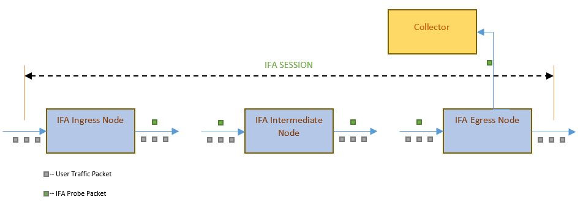
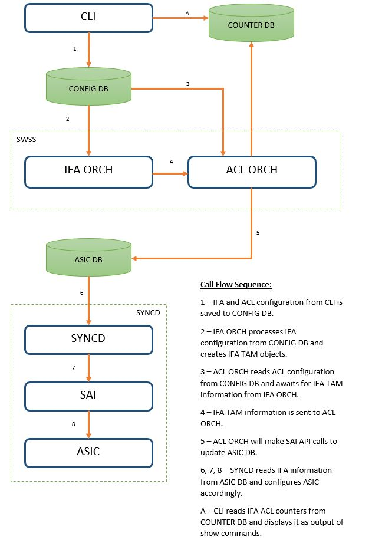
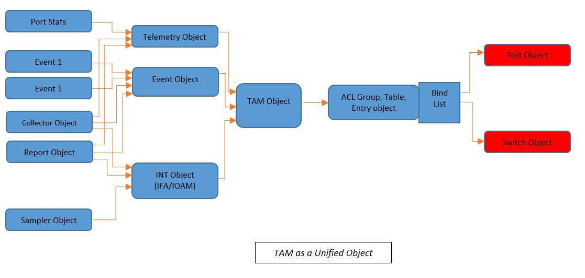

# Feature Name
Inband flow analyzer feature.

# High Level Design Document
#### Rev 0.1

# Table of Contents
  * [List of Tables](#list-of-tables)
  * [Revision](#revision)
  * [About This Manual](#about-this-manual)
  * [Scope](#scope)
  * [Definition/Abbreviation](#definition-abbreviation)
  * [1 Feature Overview](#1-feature-overview)
      * [1.1 Requirements](#1\.1-requirements)
          * [1.1.1 Functional Requirements](#1\.1\.1-functional-requirements)
          * [1.1.2 Configuration and Management Requirements](#1-1-2-configuration-and-management-requirements)
          * [1.1.3 Scalability Requirements](#1-1-3-scalability-requirements)
      * [1.2 Design Overview](#1-2-design-overview)
          * [1.2.1 Basic Approach](#1-2-1-basic-approach)
          * [1.2.2 Container](#1-2-2-container)
          * [1.2.3 SAI Overview](#1-2-3-sai-overview)
  * [2 Functionality](#2-functionality)
      * [2.1 Target Deployment Use Cases](#2-1-target-deployment-use-cases)
      * [2.2 Functional Description](#2-2-functional-description)
  * [3 Design](#3-design)
      * [3.1 Overview](#3-1-overview)
      * [3.2 DB Changes](#3-2-db-changes)
          * [3.2.1 CONFIG DB](#3-2-1-config-db)
          * [3.2.2 APP DB](#3-2-2-app-db)
          * [3.2.3 STATE DB](#3-2-3-state-db)
          * [3.2.4 ASIC DB](#3-2-4-asic-db)
          * [3.2.5 COUNTER DB](#3-2-5-counter-db)
      * [3.3 Switch State Service Design](#3-3-switch-state-service-design)
          * [3.3.1 Orchestration Agent](#3-3-1-orchestration-agent)
          * [3.3.2 Other Process](#3-3-2-other-process)
      * [3.4 Syncd](#3-4-syncd)
      * [3.5 SAI](#3-5-sai)
      * [3.6 CLI](#3-6-cli)
          * [3.6.1 Data Models](#3-6-1-data-models)
          * [3.6.2 Configuration Commands](#3-6-2-configuration-commands)
          * [3.6.3 Show Commands](#3-6-3-show-commands)
          * [3.6.4 Clear Commands](#3-6-4-clear-commands)
          * [3.6.5 Debug Commands](#3-6-5-debug-commands)
          * [3.6.6 REST API Support](#3-6-6-rest-api-support)
  * [4 Flow Diagrams](#4-flow-diagrams)
      * [4.1 IFA Config Call Flow](#4-1-ifa-call-flow)
  * [5 Error Handling](#5-error-handling)
  * [6 Serviceability And Debug](#6-serviceability-and-debug)
  * [7 Warm Boot Support](#7-warm-boot-support)
  * [8 Scalability](#8-scalability)
  * [9 Unit Test](#9-unit-test)

# List of Tables
[Table 1: Abbreviations](#table-1-abbreviations)

# Revision
| Rev |     Date    |       Author       | Change Description                |
|:---:|:-----------:|:------------------:|-----------------------------------|
| 0.1 | 06/14/2019  | Naveen Kumar Aketi | Initial version                   |

# About this Manual
This document provides general information about the Inband Flow Analyzer (IFA) feature implementation in SONiC.

# Scope
This document describes the high level design of Inband flow analyzer feature.

# Definition/Abbreviation
### Table 1: Abbreviations
| **Term**                 | **Meaning**                         |
|--------------------------|-------------------------------------|
| SAI                      | Switch abstraction interface        |
| TAM                      | Telemetry and monitoring            |
| IFA                      | Inband flow analyzer                |

# 1 Feature Overview
The Inband Flow Analyzer (IFA) feature allows configuration of an IFA session that could provide Inband-telemetry over sampled live traffic to collectors. A network monitoring application can analyze the telemetry information provided by IFA feature and provide full visibility of a network by providing metrics such as latency, packet loss and full network path that packet travels. IFA feature in SONiC will be compliant to RFC [https://datatracker.ietf.org/doc/draft-kumar-ippm-ifa](https://datatracker.ietf.org/doc/draft-kumar-ippm-ifa).

## 1.1 Requirements
### 1.1.1 Functional Requirements

1.0 IFA feature allows user to configure IFA session in a given network and provide Inband-telemetry data to collectors. IFA session is defined by flow classifiers that are used to identify a flow that should be monitored for inband telemetry.   

1.1 IFA feature is accomplished by configuring IFA session on various nodes that act as ingress, intermediate and egress devices. Device role is per flow in a node and a single node can act as ingress device for one flow and intermediate device for another flow.

1.2 Ingress device makes a sample of a flow and tags them for analysis and data collection.

1.3 Intermediate device is responsible for identifying IFA tagged flows and insertion of telemetry data.

1.4 Egress device is responsible for terminating the IFA flow by summarizing the telemetry data of the entire path and sending it to collector.

2.0.0 IFA session needs configuration as mentioned below.

2.0.0.1 Device type to specify whether INT header should be inserted or deleted.

2.0.0.2 ACL configuration to identify a flow and sample packets from that flow to insert IFA headers.

2.0.0.3 Collector configuration on egress device to forward telemetry data.

2.0.1 The IFA feature will be a part of the TAM container along with other TAM features.

3.0 UI commands available to configure IFA configuration.

3.1 UI commands available to show IFA configuration, status and statistics.

3.2 UI commands available to clear IFA configuration.

4.0 The maximum number of IFA flows are platform dependent.

4.1 Only one collector can be configured in a device.

4.2 The IFA feature is supported on physical and LAG ports.

4.3 The maximum packet length supported by IFA is platform dependent.

4.4 The IFA feature does not support dynamic port breakout feature, however it can be manually configured on broken-out ports. The IFA feature does not automatically adjust configuration in response to dynamic port breakout events.

### 1.1.2 Configuration and Management Requirements

The Inband flow analyzer feature will use the Python click framework for CLI. Once the management framework for CLI is available, CLI will be changed to align to the same.

### 1.1.3 Scalability Requirements

IFA is scaled based on availability of resources in hardware such as ACLs, TAM object ids etc.

## 1.2 Design Overview
### 1.2.1 Basic Approach

The Inband flow analyzer feature is newly developed. It is a static configuration feature, adapting the CONFIG_DB directly on top of the associated OrchAgent. There is no manager component involved.

### 1.2.2 Container
No new containers are added for Inband Flow Analyzer (IFA) feature.

### 1.2.3 SAI Overview

The SAI TAM spec specifies the TAM APIs to be used to configure the IFA functionality. Please refer to SAI-Proposal-TAM2.0-v2.0.docx in [https://github.com/opencomputeproject/SAI/tree/master/doc/TAM](https://github.com/opencomputeproject/SAI/tree/master/doc/TAM) for more details.

# 2 Functionality
## 2.1 Target Deployment Use Cases

IFA is used to proactively monitor the network for faults and performance bottlenecks, it aids in detecting data plane faults and isolating them to a given device or location and assists in planning network capacity and projecting future load.

## 2.2 Functional Description

The IFA feature allows user to configure a device as ingress, intermediate and egress nodes through PACKET\_ACTION field in ACL rule. PACKET\_ACTION field values INT\_INSERT, INT\_UPDATE and INT\_DELETE specifies ingress, intermediate and egress devices respectively. Each device type performs its own unique operations as mentioned below.

Ingress node matches an incoming flow based on the ACL configuration specified in an IFA flow and makes a copy of a sampled packet from the flow based upon the configured sampling rate. The copied packet has the IFA meta-data instructions and IFA header and IFA meta-header data added, and is then forwarded along the same path as the sampled packet. 

At intermediate nodes, IFA probe packets are identified and IFA meta-data is inserted and forwarded to next hop. IFA meta-data consists of fields such as IFA probe packet's ingress port, egress port, ingress time-stamp and egress time-stamp etc.

At egress node, IFA probe packets are identified and IFA meta-data is inserted. Egress node terminates IFA session and summarizes the telemetry data for the entire path, encapsulates the telemetry data as payload and sends it to collector.

At all other non-IFA nodes, IFA sampled packet is forwarded as a normal packet in the network.

***Example IFA multinode topology***

***Example CLI configuration***

    ***Ingress node***

        IFA configuration
            config ifa device-id 2345
            config ifa flow-name flow1 acl_ifa 1000

        ACL configuration
            "ACL_TABLE": {
                "IFA": {
                    "policy_desc" : "IFA Ingress Device Policy",
                    "stage" : "INGRESS",
                    "type" : "L3" ,
                    "ports" : "Ethernet20"
                    }
            }

            "ACL_RULE": {
                "IFA|Flow1": {
                    "PRIORITY" : "55",
                    "IP_TYPE" : "ipv4any",
                    "SRC_IP" : "10.10.0.26/32",
                    "DST_IP" : "10.10.1.26/32",
                    "PACKET_ACTION" : "int_insert"
                }
            }

    ***Intermediate node***

        IFA configuration
            config ifa device-id 2346
            config ifa device-type intermediate

    ***Egress node***

        IFA configuration
            config ifa device-id 2347
            config ifa collector-name collector1 ipv4 11.12.13.14 9070

        ACL configuration
            "ACL_TABLE": {
                "IFA": {
                    "policy_desc" : "IFA Egress Device Policy",
                    "stage" : "INGRESS",
                    "type" : "L3" ,
                    "ports" : "Ethernet20"
                    }
            }

            "ACL_RULE": {
                "IFA|Flow1": {
                    "PRIORITY" : "55",
                    "IP_TYPE" : "ipv4any",
                    "SRC_IP" : "10.10.0.26/32",
                    "DST_IP" : "10.10.1.26/32",
                    "PACKET_ACTION" : "int_delete"
                }
            }

# 3 Design
## 3.1 Overview

***IFA Architecture***

The above diagram illustrates the architecture of the IFA feature within SONiC.

## 3.2 DB Changes
### 3.2.1 CONFIG DB

IFA\_DEVICE\_TABLE

    ;Defines IFA device configuration

    key                = device         ; Only one instance and has a fixed key "device".
    deviceid           = 1 * 5DIGIT     ; Uniquely identifies a device on the network to be analyzed
    devicetype         = "intermediate" ; Optional parameter to specify device type as intermediate, value can be "intermediate" only.

    Example:
    127.0.0.1:6379[4]> keys *IFA_DEVICE*
    1) "IFA_DEVICE_TABLE|device"

    127.0.0.1:6379[4]> HGETALL "IFA_DEVICE_TABLE|device"
    1) "deviceid"
    2) 54325
    3) "devicetype"
    4) "intermediate"

IFA\_COLLECTOR TABLE

    ;Defines IFA collector configuration

    key                 = name                      ; name is collector name and should be unique.
    ipaddress-type      = "ipv4" / "ipv6"           ; Collector IP address type.
    ipaddress           = ipv4_prefix / ipv6_prefix ; Collector IP address.
    port                = 1 * 4DIGIT                ; Collector UDP port number

    Example:
    127.0.0.1:6379[4]> keys *IFA_COLLECTOR*
    1) "IFA_COLLECTOR_TABLE|collector1"

    127.0.0.1:6379[4]> HGETALL "IFA_COLLECTOR_TABLE|collector1"
    1) "ipaddress-type"
    2) "ipv4"
    3) "ipaddress"
    4) 10.20.30.40
    5) "port"
    6) 9070

IFA\_FLOW TABLE

    ;Defines an IFA flow

    key                 = name                ; name is flow name and should be unique
    acl                 = acl-name            ; Parameter to map to device information to be used for the flow.
    sampling-rate       = 1 * 5DIGIT          ; Optional parameter that indicates the sampling rate for the packets
                                              ; belonging to the flow that need to be tagged with IFA meta-data.
                                              ; One packet in every ‘sampling-rate’ packets will be tagged with IFA metadata.
                                              ; Note: This parameter is applicable for switches configured as the type ingress-node, and will be ignored for the other types. If this field is
                                              ; not specified, it indicates a 1:1 sampling.
                                              ; Range is 1 to 10000. A value of 1 indicates that all packets belonging to this flow will be sampled.

    Example:
    127.0.0.1:6379[4]> keys *IFA_FLOW*
    1) "IFA_FLOW_TABLE|flow1"

    127.0.0.1:6379[4]> HGETALL "IFA_FLOW_TABLE|flow1"
    1) "acl-name"
    2) "acl1"
    3) "sampling-rate"
    4) 1000

### 3.2.2 APP DB
N/A

### 3.2.3 STATE DB
N/A

### 3.2.4 ASIC DB
The ASIC DB is updated by SAI REDIS upon invocation of SAI REDIS APIs by IFAOrch.

### 3.2.5 COUNTER DB
N/A

## 3.3 Switch State Service Design
### 3.3.1 Orchestration Agent

A new orchestration agent class, IFAOrch is added to convert the incoming IFA config to ASIC configuration. IFAOrch subscribes to the IFA tables of CONFIG DB and converts the configuration to the SAI TAM API call sequence described in section 3.5.

IFAOrch maintains data pertaining to all the currently configured IFA entities and the associated TAM object bindings. TAM object bindings are re-used wherever possible.

### 3.3.2 Other Process
N/A

## 3.4 SyncD
N/A

## 3.5 SAI

The SAI TAM API spec defines all TAM APIs supported in SAI. Please refer to SAI-Proposal-TAM2.0-v2.0.docx in [https://github.com/opencomputeproject/SAI/tree/master/doc/TAM](https://github.com/opencomputeproject/SAI/tree/master/doc/TAM) for more details.

***Below diagram provides details about various TAM objects needed to support IFA and their correlation***

## 3.6 CLI
### 3.6.1 Data Models
NA

### 3.6.2 Configuration Commands

1) config ifa device-id {value}

This command is used to configure an IFA device identifier.

2) config ifa flow {flow_name} {{{acl_name} {sampling-rate}} \| {acl_name}}

This command is used to specify flow criteria to match against incoming flow and tag with IFA data accordingly. One packet will be sampled out of the number of packets specified in sampling-rate.

3) config ifa collector {collector-name} {ipv4 \| ipv6} {collector-ip} {collector-port}

This command is used to configure IFA collector and IFA report will be forwarded to the collector accordingly. IFA collector configuration is valid only on IFA egress type node.

4) config ifa device-type intermediate

This command is used to configure IFA device type as intermediate.

### 3.6.3 Show Commands
1) show ifa status

This show command shows the current status of IFA, like deviceid, number of flows etc.,

2) show ifa statistics {{flow-name} \| all }

This show command shows the IFA statistics per flow or all flows.

3) show ifa device

This command is used to show IFA device information.

4) show ifa flow {{flow-name} \| all }

This command is used to show IFA flow information.

5) show ifa collector {{collector-name} \| all }

This command is used to show IFA collector information.

### 3.6.4 Clear commands

1) clear ifa device-id

This command can be used to clear IFA device information and IFA configuration from hardware will be cleared.

2) clear ifa collector {collector-name}

This command can be used to clear IFA collector configuration.

3) clear ifa flow {flow-name}

This command can be used to clear IFA flow configuration.

4) clear ifa device-type intermediate

This command can be used to clear IFA device type intermediate configuration.

### 3.6.5 Debug Commands
Debug commands will be available once the debug framework is available. The debug commands are needed to dump:

- IFA related entries and TAM object bindings maintained by IFAOrch.

### 3.6.6 REST API Support
N/A

# 4 Flow Diagrams
## 4.1 Config call flow

# 5 Error Handling

## CLI
- CLI configuration sanity will be enforced by the CLI handler and any invalid configuration is rejected. An error is displayed to the user notifying the reason for rejection of the configuration.

## IFAOrch
- Any error occurring in the orchestration agent is logged appropriately via SWSS logging.
- Errors or failures of SAI APIs will be logged by IFAOrch.
- On failure of a SAI TAM API in the config sequence of section 3.5, the previously configured steps will be rolled back i.e previously created intermediate TAM objects for IFA etc will be destroyed.

# 6 Serviceability and Debug
Debug commands specified in section 3.6.5 will be supported once the debug framework is available.

# 7 Warm Boot Support
No special handling is done for the warm boot case. The IFA configuration is restored from the Config DB and IFA functionality will continue to work as it is through a warm boot. 

# 8 Scalability
N/A

# 9 Unit Test
## CLI

1.  Verify CLI command to configure IFA device for device id.
2.  Verify CLI command to configure IFA device type intermediate.
3.  Verify CLI command to configure IFA collector config with IPv4 type.
4.  Verify CLI command to configure IFA collector config with IPv6 type.
5.  Verify ACL configuration with packet action type as int_insert for IPv4 type ACL.
6.  Verify ACL configuration with packet action type as int_delete for IPv4 type ACL.
7.  Verify ACL configuration with packet action type as int_insert for IPv6 type ACL.
8.  Verify ACL configuration with packet action type as int_delete for IPv6 type ACL.
9.  Verify ACL configuration with packet action type as int_update is created when IFA device type is configured.
10. Verify ACL configuration with packet action type as int_update is cleared when IFA device type is cleared. 
11. Verify CLI command to configure IFA flow with acl and sampling rate.
12. Verify CLI clear command to clear IFA device.
13. Verify CLI clear command to clear IFA device type.
14. Verify CLI clear command to clear IFA flow.
15. Verify CLI clear command to clear IFA collector.
16. Verify CLI show command to show IFA status.
17. Verify CLI show command to show IFA statistics for all flows.
18. Verify CLI show command to show IFA statistics for a specific flows.
19. Verify CLI show command to show IFA device.
20. Verify CLI show command to show IFA flow.
21. Verify CLI show command to show IFA collector.

## IFAOrch
1. Verify if IFA configuration from CONFIG DB is received by IFAOrch.
2. Verify if IFAOrch is able to create TAM objects for IFA configuration via SAI TAM APIs successfully.
3. Verify if IFAOrch is able to delete existing IFA configuration via SAI TAM APIs successfully.
4. Verify if IFAOrch is able to use existing TAM objects for IFA config that uses a previously configured IFA collector or IFA flow.
5. Verify if IFAOrch rolls back config in a clean way if there is a SAI API failure.
6. Verify if IFAOrch is able to notify ACL orch for IFA ACL creation.

## Functional Tests
1. Verify if ingress traffic matching IFA flow is sampled as per sampling rate.
2. Verify if IFA headers are inserted correctly at ingress device.
3. Verify if IFA headers are inserted correctly at intermediate device.
4. Verify if IFA headers are inserted correctly at egress device.
5. Verify if IFA report is sent to IFA collector from egress device.
6. Verify that IFA flow matching egress device ACL is terminated correctly, when a node has both intermediate device ACL and egress device ACL. 
7. Verify that there is no crash encountered at any of the layers with an invalid IFA configuration. 
8. Verify that an invalid configuration is rejected gracefully at appropriate layers.
9. Verify that IFA configuration is restored after warmboot.
10. Verify if IFA configuration of a session is cleared from hardware when the attached acl is removed.

## Negative Tests
1. Verify if CLI throws error when a user tries to create a duplicate IFA flow.
2. Verify if CLI throws error when a user tries to create a duplicate IFA collector.
3. Verify if CLI returns error if CLI is unable to write the IFA config to config DB.
4. Verify if CLI returns error when a IPv4 address is configured for collector type IPv6.
5. Verify if CLI returns error when a IPv6 address is configured for collector type IPv4.
6. Verify if CLI returns entry not found when a clear command is issued on non-existent flow.
7. Verify if IFAOrch logs an error on receipt of an incorrect IFA table entries from CONFIG DB.
8. Verify if IFAOrch logs an error if it is unable to read IFA table data from CONFIG DB.
9. Verify if IFAOrch logs all errors encountered during processing of the incoming IFA config request.
10. Verify if IFAOrch logs any errors arising out of SAI API failure.
11. Verify if IFAOrch logs an error when no further IFA configuration can be configured to hardware.
12. Verify if error is logged when IFA collector is not reachable or collector is not running on UDP port.
13. Verify that crash is not seen when IFA is configured on a platform that does not support IFA.
14. Verify that IFA telemetry packet is dropped when packet length exceeds the limit defined by platform. 
