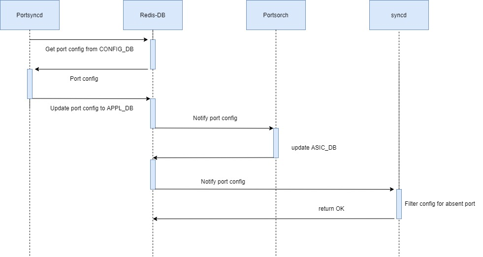

# SONiC Line Card Hot Swap

## High Level Design document

## Table of contents
[About this manual](#about-this-manual)  
[Revision](#revision)  
[Abbreviation](#abbreviation)  
[List of figures](#list-of-figures)  
* [1 Introduction and Scope](#introduction)  
* [2 Requirements](#requirements)  
    * [2.1 Functional Requirements](#functionality)  
    * [2.2 Configuration and Management Requirements](#configuration-and-management)  
* [3 Design](#design)  
    * [3.1 Architecture](#architecture)  
    * [3.2 OrchAgent Changes](#orchagent-changes) 
    * [3.3 Syncd Changes](#syncd-changes) 
    * [3.4 DB Changes](#db-changes)  
        * [3.4.1 State DB](#state-db)
    * [3.5 SAI](#sai)  
    * [3.6 CLI](#cli)
* [4 Flows](#flows)  
    * [4.1 Initialization](#initialization)  
        * [4.1.1 Event Callback Registration](#event-callback)
        * [4.1.2 Port State Table](#port-state-table)
        * [4.1.3 Port initialize](#port-initialize)
    * [4.2 Line Card Hot Event Notification](#notification)  
    * [4.3 Re-apply Configuration on Line Card](#reapply)  
* [5 Serviceability and Debug](#serviceability)
* [6 Warm Boot Support](#warm-boot)
* [7 Scalability](#scalability)
* [8 Tests](#tests)  
    * [8.1 Unit tests](#unit-test)  
* [9 Unsupported features](#unsupported)

## About this manual<a name="about-this-manual"></a>
This document describes the software high-level design of line card hot swapping implementation in SONiC.

## Revision<a name="revision"></a>

| Rev | Date       | Author         | Description                       |
|:---:|:----------:|:--------------:|:----------------------------------|
| 0.1 | 05/02/2020 | Fish, Steve    | Initial version                   |

## Abbreviation<a name="abbreviation"></a>

|Term	|Meaning                     |
|:-----:|:--------------------------:|
|PHY	|Physical layer              |
|DB     |Date base                   |
|CLI    |Command-Line Interface      |
|IPC	|Inter Process communication |

## List of figures<a name="list-of-figures"></a>
[Figure 1: Line Card Hot Swap High Level Architecture](./f1.jpg)  
[Figure 2: Event callback registration](./f2.jpg)  
[Figure 3: State table update](./f3.jpg)  
[Figure 4: Port Initialize_1](./f4.jpg)  
[Figure 5: Port Initialize_2](./f5.jpg)  
[Figure 6: Line Card Event Notification](./f6.jpg)  
[Figure 7: Line Card Event Notification Flow](./f7.jpg)  
[Figure 8: Reapply Configuration flow](./f8.jpg)  

## 1 Introduction and Scope<a name="introduction"></a>

A modern network switch in data center must be a high fault tolerance equipment which consists of many swappable hardware components (e.g., PSU/FAN/QSFP). 
For stability, it is not allowed to reboot the device after hot-swapping hardware components. The swappable design is very important for data center to minimize the impact of failures on certain hardware components on the switch. 
This HLD provides a generic software mechanism of line card hot swapping, which includes the architecture, functional flow and CLI command.

## 2 Requirements<a name="requirements"></a>

### 2.1 Functional Requirements<a name="functionality"></a>

**This feature will support the following functionality:**
1.	1 chassis consists of swappable line cards.
2.	Every line card with the same card type, 32*100G(Different card type will be implemented in the near future.)
3.	Each line card can be
    *   plug in
    *	unplug out
4.	Plug in
    *	Event log with card number, card type
    *	Automatically apply the configuration for that line card
5.	Unplug out
    *	Event log with card number, card type
    *	All ports on the line card are link down.
    *	User still can configure the line card, but the configuration will not take effect until the line card is plugged in again.
    *	This unplug-out event should not impact all other line cards’ traffic.


### 2.2 Configuration and Management Requirements<a name="configuration-and-management"></a>

Provide CLI commands to display line card status.

## 3 Design<a name="design"></a>

### 3.1 Architecture<a name="architecture"></a>
The architecture and module dependency are shown in the following figure.


###### Figure 1: Line Card Hot Swap High Level Architecture

Figure 1 shows the integration of line card hot swap design and SONiC architecture. SAI layer needs to receive the line card state change event from line card driver. In the design, SAI always listens to line card change event. The line card kernel module is in charge of detecting line card status. After boot up, this kernel module should be inserted automatically.


### 3.2 OrchAgent Changes<a name="orchagent-changes"></a>

OrchAgent will register an event callback function to publish the line card hot swapping events to DB and PortsOrch will be responsible for processing the line card events.

### 3.3 Syncd Changes<a name="syncd-changes"></a>

A new table, Port State Table, is created in syncd to record port present status. When user configure a port via SAI, syncd will check the port state in Port State Table. If the port is not present, the configuration will not be applied on that port and return SUCCESS.


## 3.4 DB Changes<a name="db-changes"></a>

### 3.4.1 State DB<a name="state-db"></a>
A new table STATE_LINE_CARD_TABLE is created in state DB to store current status of each line card.

**Table Schema**
```
;Defines schema for STATE_LINE_CARD_TABLE that stores line card status 
key                = LINE_CARD|LINECARD_SLOT_INDEX
status             = "present" / "not present"  ; line card present status. 
speed              = 8DECDIG                    ; line card speed.
```

**redis-cli example**

```
127.0.0.1:6379[6]> hgetall "LINE_CARD|3"
1) "status"
2) "present"
3) "speed"
4) "100000"
```
## 3.5 SAI<a name="sai"></a>
Switch SAI interface APIs are already defined but there is no line card related attributes. 
The table below represents the SAI attributes which shall be extended for line card hot swap design.

###### Table 1: switch SAI attributes
| SAI attributes                                         | Line card component                        |
|--------------------------------------------------------|--------------------------------------------|
| SAI_SWITCH_ATTR_SWITCH_LINE_CARD_NOTIFY                | Event notification callback function       |
| SAI_SWITCH_ATTR_LINE_CARD_STATUS                       | Line card state                            |
| SAI_SWITCH_ATTR_LINE_CARD_SPEED                        | Line card speed                            |
| SAI_SWITCH_ATTR_LINE_CARD_SLOTS                        | maximum number of supported line card slot |

The **create_switch** SAI API is used to set the line card event change function. 
This function is a porting layer API which be implemented by chip vendor to handle line card event change.  
+ SAI_SWITCH_ATTR_SWITCH_LINE_CARD_NOTIFY  

```cpp
/**
 * @brief Create switch
 *
 * SDK initialization/connect to SDK. After the call the capability attributes should be
 * ready for retrieval via sai_get_switch_attribute(). Same Switch Object id should be
 * given for create/connect for each NPU.
 *
 * @param[out] switch_id The Switch Object ID
 * @param[in] attr_count Number of attributes
 * @param[in] attr_list Array of attributes
 *
 * @return #SAI_STATUS_SUCCESS on success, failure status code on error
 */
typedef sai_status_t (*sai_create_switch_fn)(
        _Out_ sai_object_id_t *switch_id,
        _In_ uint32_t attr_count,
        _In_ const sai_attribute_t *attr_list);
        
/**
 * @brief Switch line card event notification.
 *
 * For notify when line card status change
 *
 * @count data[count]
 *
 * @param[in] count Number of notifications
 * @param[in] data Array of line card status
 */
typedef void (*sai_switch_line_card_notification_fn)(
        _In_ uint32_t count,
        _In_ const sai_switch_line_card_info_t *data);


    /**
     * @brief Event notification callback
     * function passed to the adapter.
     *
     * Use sai_switch_line_card_notification_fn as notification function.
     *
     * @type sai_pointer_t sai_switch_line_card_notification_fn
     * @flags CREATE_AND_SET
     * @default NULL
     */
    SAI_SWITCH_ATTR_SWITCH_LINE_CARD_NOTIFY,
    
/**
 * @brief Attribute data for line card status notify
 */
typedef struct _sai_switch_line_card_info_t
{
    /** Slot id */
    sai_uint8_t card_slot;

    /** Speed */
    sai_uint32_t speed;

    /** Status */
    sai_switch_line_card_status_t status;

} sai_switch_line_card_info_t;

```

The **get_switch_attribute** SAI API is used to get the attributes on switch which were listed in Table 1.  

```cpp
/**
 * @brief Get switch attribute value
 *
 * @param[in] switch_id Switch id
 * @param[in] attr_count Number of attributes
 * @param[inout] attr_list Array of switch attributes
 *
 * @return #SAI_STATUS_SUCCESS on success, failure status code on error
 */
typedef sai_status_t (*sai_get_switch_attribute_fn)(
        _In_ sai_object_id_t switch_id,
        _In_ uint32_t attr_count,
        _Inout_ sai_attribute_t *attr_list); 
```

+ SAI_SWITCH_ATTR_LINE_CARD_STATUS  
+ SAI_SWITCH_ATTR_LINE_CARD_SPEED  
+ SAI_SWITCH_ATTR_LINE_CARD_SLOTS  

```cpp
    /**
     * @brief Line card state
     *
     * @type sai_u8_list_t
     * @flags READ_ONLY
     */
    SAI_SWITCH_ATTR_LINE_CARD_STATUS,

    /**
     * @brief Line card speed
     *
     * @type sai_u32_list_t
     * @flags READ_ONLY
     */
    SAI_SWITCH_ATTR_LINE_CARD_SPEED,

    /**
     * @brief Maximum number of supported line card slot on the switch
     *
     * @type sai_uint8_t
     * @flags READ_ONLY
     */
    SAI_SWITCH_ATTR_LINE_CARD_SLOTS,
```
In SAI, **the chip vendor should provide an IPC method to receive the line card event**. **Platform provider will based on this method to send the event**.
Hence, the rest of implementation effort would be platform dependent driver.

### 3.6 CLI<a name="cli"></a>

**This feature will support the following commands:**
show interface status: display Line card present status and card slots number of each port.

```
admin@sonic:~$ show interface status
  Interface    Lanes   Speed    MTU          Alias    Vlan   Oper   Admin   Type    Asym PFC   Line Card Slot   Line Card Status
-----------  -------  ------  -----  -------------  ------  -----  ------  -----  ----------  ---------------  -----------------
  Ethernet1    81,82    100G   9100   hundredGigE1  routed   down      up    N/A         N/A                1            present
  Ethernet3    83,84    100G   9100   hundredGigE2  routed   down      up    N/A         N/A                1            present
  Ethernet5    85,86    100G   9100   hundredGigE3  routed   down      up    N/A         N/A                1            present
  Ethernet7    87,88    100G   9100   hundredGigE4  routed   down      up    N/A         N/A                1            present
  Ethernet9    89,90    100G   9100   hundredGigE5  routed   down      up    N/A         N/A                1            present
 Ethernet11    91,92    100G   9100   hundredGigE6  routed   down      up    N/A         N/A                1            present
 Ethernet13    93,94    100G   9100   hundredGigE7  routed   down      up    N/A         N/A                1            present
 Ethernet15    95,96    100G   9100   hundredGigE8  routed   down      up    N/A         N/A                1            present
 Ethernet17  113,114    100G   9100   hundredGigE9  routed   down      up    N/A         N/A                1            present

```

## 4 Flows<a name="flows"></a>
### 4.1 Initialization<a name="initialization"></a>
#### 4.1.1 Event Callback Registration<a name="event-callback"></a>
For notifying the SONiC system when line card state changes, the orchagent will register a callback function at system initialization.

Figure 2 shows the flow of event callback registration.


###### Figure 2: Event callback registration

1.	At orchagent initialization, orchagent will call the SAI-Redis create_switch() to register event callback function for all line card event types.
2.	This will trigger Syncd to call create_switch() in SAI and register event callback function for all event type.
3.	The process who wants to get the event notifications, can directly subscribe on Redis DB.

#### 4.1.2 Port State Table<a name="port-state-table"></a>

At initialization, syncd creates an empty Port State Table, and then gets current line card status to store each port status into Port State Table.

When a line card is inserted or removed, syncd will get the event and will update the line card status into the Port Status Table, as shown in Figure 3.


###### Figure 3: State table update

When user needs to configure a port via SAI, it will check the port status in Port State Table.  If the port is not present, SAI will not configure the port and return SUCCESS to forge the successful configuration.

#### 4.1.3 Port initialize<a name="port-initialize"></a>

Figure 4 shows the port initialization flow when boot up.


###### Figure 4: Port Initialize_1

1.	PortsOrch will use SAI-Redis to get current line card information before port initialization starts.



###### Figure 5: Port Initialize_2
2.	When port initialization starts, the “portsyncd” will get all port configuration from CONFIG_DB.
3.	And “portsyncd” will sync the port configuration to APPL_DB.
4.	“PortsOrch” will be notified when APPL_DB port configuration change.
5.	“PortsOrch” initializes ports base on APPL_DB.
6.	The configuration action will send to SDK via syncd.
7.	The syncd does not apply configurations onto the absent ports.

### 4.2 Line Card Event Notification:<a name="notification"></a>


###### Figure 6: Line Card Event Notification

Figure 6 shows the notification flow of line card event. The platform provider need to provide the line card driver to send notification to SAI layer.
Both interrupt mode and polling mode can be implemented. Whether in interrupt mode or polling mode, when a line card state change event is detected, the kernel module should send the event to user space through IPC method. 
SAI receives the line card change event and log the event to syslog. To notify the SONiC, SAI will execute the callback function. In SONiC, the callback function is in charge of sending a notification to database. 
The application who subscribes the database will be notified. After all the subscriber receive the notification, the notification in database will be erased.


###### Figure 7: Line Card Event Notification Flow
1.	Platform driver send line card event via IPC.
2.	SAI and SDK receive line card event and execute call back function.
3.	Syncd will publish this event via STATE_DB. All subscribers will be notified by STATE_DB.


### 4.3 Re-apply Configuration on Line Card<a name="reapply"></a>

To support hot plug-in and unplug-out, the system needs to subscribe line card event and re-apply configuration when line card status changes.

In SONiC system, the “PortsOrch” will subscribe port change event, and doing action when port change.So portsOrch also involves the tasks of line card hot swapping.
Since the system is only for 100G line card currently and the config_db.json will contain all ports configuration, the “PortsOrch” only need do “config load” action when receiving line card change event. This will trigger system to reconfigure all ports again.
The “config load” action will not affect ongoing traffic. So the Plug-in/Unplug-out action will not affect ongoing traffic.

Following chart shows the reconfiguration flow in SONiC.


###### Figure 8: Reapply Configuration flow

1.	While Plug-in/Unplug-out line card, syncd will update the “Port State Table” for “Port Config Filter”.  
2.	After receiving line card event, it will execute callback function and PUBLISH the event to Redis DB.
3.	The “PortsOrch” will be notified when line card change.
4.	“PortsOrch” will do “config load”.

The config flow will follow Figure5 to reapply the configuration to SAI.

5.	“Portsyncd” will be notified when port configuration be set in CONFIG_DB.
6.	And synchronize to APPL_DB
7.	“PortsOrch” will be notified when port configuration be set in APPL_DB
8.	“PortsOrch” apply the configurations.
9.	The configuration will send to SDK via syncd. Again, syncd will filter out the configuration for not-present ports.

## 5 Serviceability and Debug<a name="serviceability"></a> 

Plug in/Unplug-out event will be logged in syslog with NOTICE level

## 6 Warm Boot Support<a name="warm-boot"></a>

There is no new configuration needed for line card hot swapping, so the mechanism supports warm reboot.

## 7 Scalability<a name="scalability"></a>

Hot swapping line cards with different card types, ex, 100G X 32 and 400G X 8 on line card. 

## 8 Tests<a name="tests"></a>

### 8.1 Unit tests<a name="unit-test"></a>
1. **Basic test**
    1.   The line card LED shall be dark when line card is not present.
    2.   The evenlog shall pop up an alert message which shows “Line card x has been plugged in” when line card plug in and presented.
    3.   The evenlog shall pop up an alert message which shows “Line card x has been plugged out” when line card unplug out.
2. **Port status test**
    1.   The port status shall be “down” and the present status shall be “not presented” when line card is not plug-in.
    2.   The port status shall be “down” and the present status shall be “presented” when line card is plug-in without any port connected.
    3.   The port status shall be “up” and the present status shall be “presented” when line card is plug-in and some port has connected.
    4.   The port status shall be “up” and the present status shall be “presented” when line card is plug-in and some port has connected with SFP/AOC/DAC module on it.
3. **Configuration test**
    1.   DUT shall allow to configure the line card interface even line card is not presented.
    2.   The configuration shall be applied without any error when the configuration has been configured before line card plug-in.
    3.   The configuration shall not be cleared after line card unplug-out. (Configure when line card is NOT presented)
    4.   The configuration shall not be cleared after line card unplug-out. (Configure when line card is presented)
4. **Traffic Forwarding test**
    1.   The traffic forwarding shall not block when line card plug-in/unplug-out. (Traffic forwarding between 2 ports in 1st and swap operating in 2nd, 3rd and 4th with L2 traffic flow)
    2.   The traffic forwarding shall not block when line card plug-in/unplug-out. (Traffic forwarding between 2 ports in 1st and swap operating in 2nd, 3rd and 4th with L3 traffic flow)

## 9 Unsupported features<a name="unsupported"></a>
The current mechanism does not consider the hot swapping between line cards with different types, ex, 100G and 400G.


