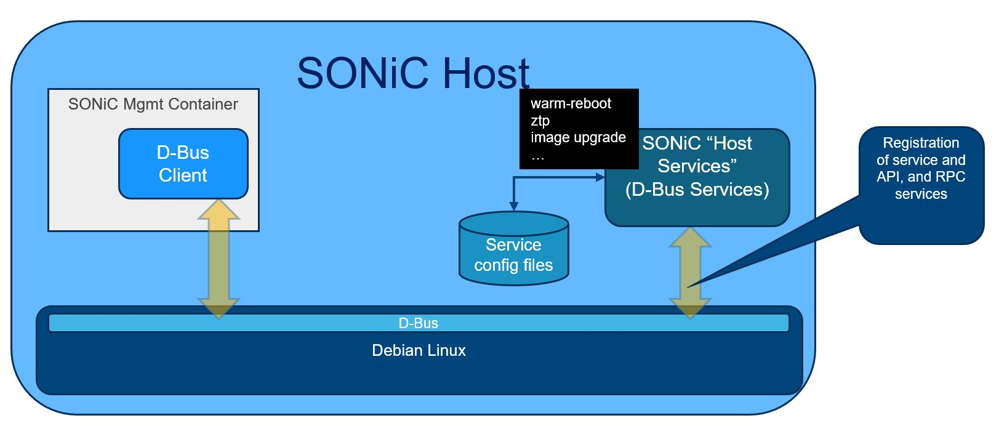
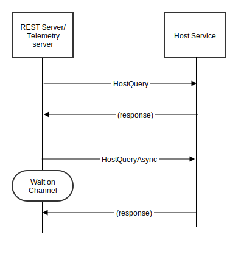

# Feature Name
Docker to Host communication

# High Level Design Document
#### Rev 0.2

# Table of Contents
  * [List of Tables](#list-of-tables)
  * [Revision](#revision)
  * [About This Manual](#about-this-manual)
  * [Scope](#scope)
  * [Definition/Abbreviation](#definitionabbreviation)

# List of Tables
[Table 1: Abbreviations](#table-1-abbreviations)

# Revision
| Rev |     Date    |       Author       | Change Description                |
|:---:|:-----------:|:------------------:|-----------------------------------|
| 0.1 | 10/28/2019  | Nirenjan Krishnan  | Initial version                   |
|:---:|:-----------:|:------------------:|-----------------------------------|
| 0.2 | 12/08/2019  | Mike Lazar         | Add details about architecture    |
|:---:|:-----------:|:------------------:|-----------------------------------|
| 0.3 | 12/16/2019  | Mike Lazar         | Add security and logging info     |

# About this Manual
This document provides general information about the Docker to Host
communication feature in SONiC.

# Scope
This document describes the high level design of Docker to Host communication.
This describes the infrastructure provided by the feature, and example usage,
however, it does not describe the individual host-specific features.

# Definition/Abbreviation

### Table 1: Abbreviations
| **Term**                 | **Meaning**                                       |
|--------------------------|---------------------------------------------------|
| D-Bus                    | Desktop Bus: https://en.wikipedia.org/wiki/D-Bus  |

# 1 Feature Overview

The management framework runs within a Docker container, and performs actions
translating the user CLIs or REST requests to actions. Most of these actions
perform some operation on the Redis database, but some of them require
operations to be done on the host, i.e., outside the container. This document
describes the host server, and translib API that are used to communicate between
the Docker container and the host.

## 1.1 Requirements

### 1.1.1 Functional Requirements

* The SONiC Management Framework and Telemetry containers must be able to issue
  requests to the host, and return the responses from the host.
* The individual applications that need access to the host must be able to
  create a host module and easily issue requests and get responses back from the
  host.
* The host communication API shall be available in Translib, and shall provide
  both synchronous and asynchronous communication methods.
* It shall be possible to configure the identity of the Linux user accounts who have access to a D-Bus socket.
* It shall be possible to configure containers in such a way that only certain containers (e.g. SONiC Mgmt.)
  have access to the D-Bus socket.

### 1.1.2 Configuration and Management Requirements

N/A

### 1.1.3 Scalability Requirements

N/A

### 1.1.4 Warm Boot Requirements

N/A

## 1.2 Design Overview
### 1.2.1 Basic Approach

The code will extend the existing Translib modules to provide a D-Bus based
query API to issue requests to the host. The host service will be a Python based
application which listens on known D-Bus endpoints.https://en.wikipedia.org/wiki/D-Bus

The individual app modules can extend the host service by providing a small
Python snippet that will register against their application endpoint.

### 1.2.2 Container

SONiC Management Framework, gNMI Telemetry containers

### 1.2.3 SAI Overview

N/A

# 2 Functionality
## 2.1 Target Deployment Use Cases

All deployments

## 2.2 Functional Description

This feature enables management applications to issue
requests to the host to perform actions such as:
* image install / upgrade
* ZTP enable/disable
* initiate reboot and warm reboot using existing scripts
* create show-tech tar file using existing show-tech script
* config save/reload using existing scripts

# 3 Design
## 3.1 Overview

The feature extends the SONiC management framework to add a D-Bus service on the
host. This service will register against a known endpoint, and will service
requests to the endpoint. Application modules will add snippets to the host
service, which will automatically register their endpoints, and the app module
in the container can use the APIs provided in Translib to send the request to
the host, and either wait for the response (if the request was synchronous), or
receive a channel and wait for the request to return the response on the
channel (asynchronous request).

The architecture of a D-Bus host service in a SONiC environment is illustrated in the diagram below:

Note. The Linux D-Bus implementation uses Unix domain sockets for client to D-Bus service communications.
All containers that use D-Bus services will bind mount
(-v /var/run/dbus:/var/run/dbus:rw) the host directory where D-Bus service sockets are created.
This ensures that only the desired containers access the D-Bus host services.

D-Bus provides a reliable communication channel between client (SONiC management container) and service (native host OS) – all actions are acknowledged and can provide return values. It should be noted that acknowledgements are important for operations such as “image upgrade” or “config-save”. In addition, D-Bus methods can return values of many types – not just ACKs. For instance, they can return strings, useful to return the output of a command.

### 3.1.1 Security of D-Bus Communications
In addition to standard Linux security mechanisms for file/Unix socket access rights (read/write), D-Bus provides a separate security layer, using the D-Bus service configuration files.
This allows finer grain access control to D-Bus objects and methods - D-Bus can restrict access only to certain Linux users.

### 3.1.2 Command Logging

It is possible to track and log the user name and the command that the user has requested.
The log record is created in the system log.

## 3.2 DB Changes
### 3.2.1 CONFIG DB
N/A
### 3.2.2 APP DB
N/A
### 3.2.3 STATE DB
N/A
### 3.2.4 ASIC DB
N/A
### 3.2.5 COUNTER DB
N/A

## 3.3 Switch State Service Design
### 3.3.1 Orchestration Agent
N/A
### 3.3.2 Other Process
N/A
## 3.4 SyncD
N/A
## 3.5 SAI
N/A

## 3.6 User Interface
### 3.6.1 Data Models
N/A
### 3.6.2 CLI
#### 3.6.2.1 Configuration Commands
N/A
#### 3.6.2.2 Show Commands
N/A
#### 3.6.2.3 Debug Commands
N/A
#### 3.6.2.4 IS-CLI Compliance
N/A
### 3.6.3 REST API Support
N/A

# 4 Flow Diagrams

# 5 Error Handling

The `hostQuery` and `hostQueryAsync` APIs return a standard Go `error` object,
which can be used to handle any errors that are returned by the D-Bus
infrastructure.

# 6 Serviceability and Debug
N/A

# 7 Warm Boot Support
N/A

# 8 Scalability
N/A

# 9 Unit Test
List unit test cases added for this feature including warm boot.

# 10 Internal Design Information
N/A
